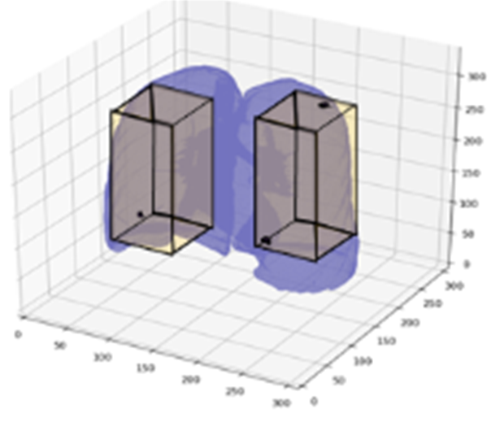

# Deep Image Prior and Neural Cellular Automata Nodule Synthesis
Main steps of the study "Patient-Specific 3d Cellular Automata Nodule Growth Synthesis In Lung Cancer Without The Need Of External Data (2021)".

## Main steps
1. LUNA16 Dataset Preprocessing
1. Apply deep image prior on nodules (lungs blocks 96x160x96)
1. Prepare dataset for GANs and pylidc characteristics 
1. Get only the nodule
1. Cellular Automata
1. Insert CA generated nodule for nodule detection


#### 1. Data preprocessing:
```bash
pip install -r requirements_develop.txt
python process_lungs_and_segmentations.py
```
```diff
- INPUTS:
- Path to LUNA16 dataset.
- Path to LUNA16 candidates: candidates_V2.csv
- Path to LUNA16 annotations: annotations.csv
- Path to LUNA16 segmentations: seg-lungs-LUNA16/ 
+ OUTPUTS (preprocessed images for each scan):
+ lungs_segmented
+ processed_images (cluster_id_images)
+ consensus_masks
+ maxvol_masks
```

#### 2. Nodule inpainting with deep image prior
Performs inpaiting on lung nodules on lung blocks (96x160x96) using 2D convolutions
```bash
pip install -r requirements_inpainting.txt
python inpainting.py
```
```diff
- INPUTS:
- Preprocessed images for each scan (from 1.).
- Path to LUNA16 segmentations: seg-lungs-LUNA16/ 
+ OUTPUTS (for lung block of 96x160x96):
+ arrays/last/{id_series}_{lungL/R}_{ndls_n}
+ arrays/orig/{id_series}_{lungL/R}_{ndls_n}
+ arrays/masks/{id_series}_{lungL/R}_{ndls_n}
+ arrays/masks_nodules/{id_series}_{lungL/R}_{ndls_n}
+ arrays/masks_lungs/{id_series}_{lungL/R}_{ndls_n}
+ box_coords/{id_series}_{lungL/R}_{ndls_n} (coords containing the ndl)
```


#### 3. Get only the nodules from the (96x160x96) lung blocks
```bash
pip install -r requirements_develop.txt
python get_ndl_from_inpainted.py
```
```diff
- INPUTS: (lung blocks of 96x160x96):
- arrays/last
- arrays/orig
- arrays/masks
- arrays/masks_nodules
- arrays/masks_lungs
- box_coords
+ OUTPUTS (cubes of size 64x64x64 centered on each nodule):
+ original (original image)
+ inpainted_inserted (nodule inpainted inserted into original image)
+ mask
+ nodule_info
```
 


#### TO DO nodule growing with image-to-image translation (cycleGAN)
```bash
pip install -r requirements_inpainting.txt
python cycleGAN.py
```

#### False positive Reduction
check https://github.com/octaviomtz/LUNA16_nodule_detection